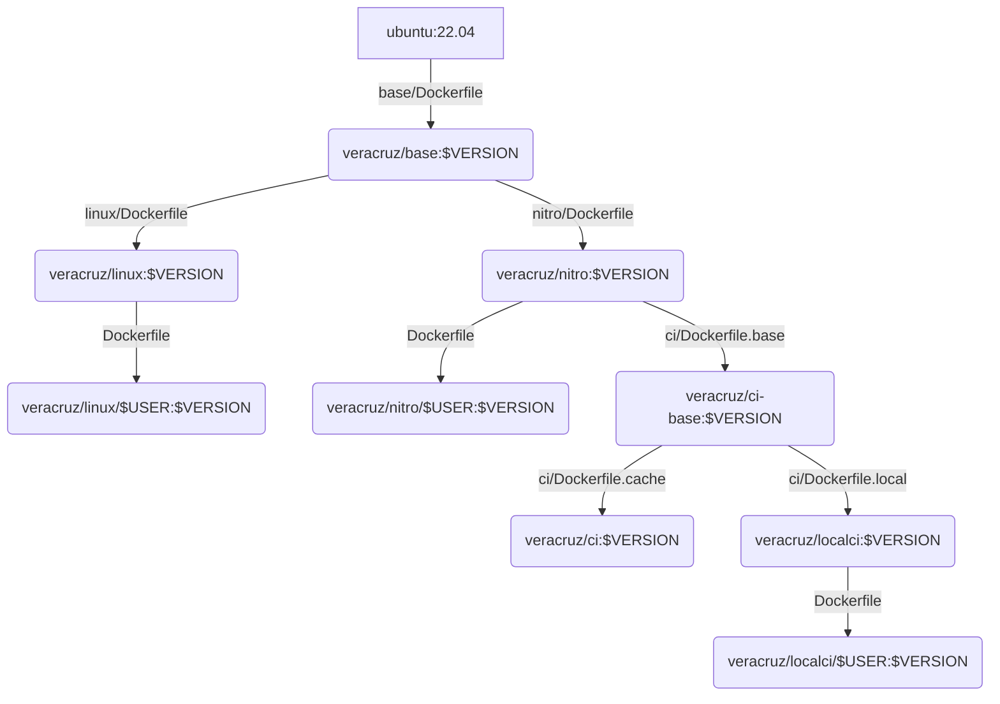

# Building Veracruz


This directory has the code for building the Docker containers used
for developing Veracruz.

## Requirements

- **Docker:**
We use Docker to provide a consistent build environment.  Follow this guide to [install Docker](https://docs.docker.com/engine/install/) if necessary.

## Local build setup

Enter this directory in a local copy of the Veracruz source:
```
cd veracruz/docker
```

## Build and run

There are several different Docker containers that can be used,
depending on the platform. If you are new to Veracruz you should
probably try `localci` first.

### `localci`

To build the container:
```
make localci-build
```

To run the container:
```
make localci-run
```

With `docker ps` you should now be able to see the container running.

To get a shell in the container running as the appropriate non-root user:
```
make localci-exec
```

The Veracruz tree should be mounted in the container, so you can run,
for example:
```
cd /work/veracruz/workspaces
make linux && make linux-tests
make nitro
```

(On an ordinary Linux system you can build for `nitro`, but not run
the tests.)

### `linux`

This is the same as `localci`, above, except only for the Linux
platform.

### `nitro`

This is the same as `localci`, above, except only for the AWS Nitro
platform and you can also run the Nitro tests on appropriate hardware.
See the [Nitro instructions](../docs/NITRO_INSTRUCTIONS.md).

### `ci`

This is the same as `localci`, above, except that you will run as
root. This container is used for CI in the cloud.

### Docker images


